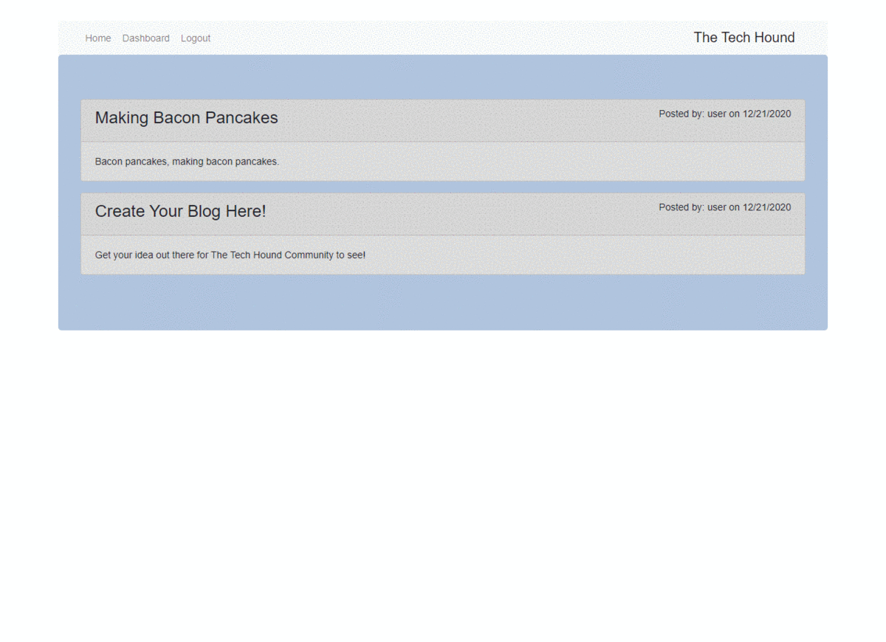

# The Tech Hound

## Description

## Table of Contents

-   [Installation Instructions](#installation-instructions)
-   [Usage Information](#usage-information)
-   [License](#license)
-   [Contribution Guidelines](#contribution-guidelines)
-   [Test Instructions](#test-instructions)
-   [Questions](#questions)

## Installation Instructions

This application requires Node.js which can be downloaded <a href="https://nodejs.org/en/" target="_blank">here</a>. It utilizes a few node modules called <a href="https://expressjs.com/" target="_blank"> express</a>, <a href="https://sequelize.org/" target="_blank"> sequelize</a>, <a href="https://www.npmjs.com/package/dotenv" target="_blank"> dotenv</a>, <a href="https://www.npmjs.com/package/bcrypt" target="_blank"> bcrypt</a>, <a href="https://www.npmjs.com/package/connect-session-sequelize" target="_blank"> connect-session-sequelize</a>, <a href="https://www.npmjs.com/package/express-handlebars" target="_blank"> express-handlebars</a>, <a href="https://www.npmjs.com/package/express-session" target="_blank"> express-session</a>, <a href="https://www.npmjs.com/package/http-errors" target="_blank"> http-errors</a>, and <a href="https://www.npmjs.com/package/mysql2" target="_blank"> mysql2</a>. All packages can be installed using <a href="https://www.npmjs.com/" target="_blank">node package manager</a>. This requires a local or remote mySQL server to be running for database storage, the database can be populated with command "npm run seed" after it is created. Simply run "npm install" in the root directory to install all dependencies.

## Usage Information

This is a tech blog website where users can share their views on existing and emerging technology. There is a login system that stores user accounts in a SQL based database. Once logged in users can comment on existing posts and create posts of their own. If a user is inactive for five minutes then they will be logged out of their user session and will have to login again upon revisit. There is a user dashboard where posts can be updated and deleted. What are you waiting for, get out there and discover The Tech Hound community!

## License

This project is utilizing the MIT License

## Contribution Guidelines

This is a fully open source project, you may fork the repository and any pull requests will be viewed and implemented accordingly.

## Test Instructions

There are no test scripts setup for this program currently.

## Questions

If there are further questions please contact me with the following.

 AndrewMorrow - <a href="https://github.com/AndrewMorrow" target= "_blank">Github</a>

Email: beardedmongo@gmail.com
